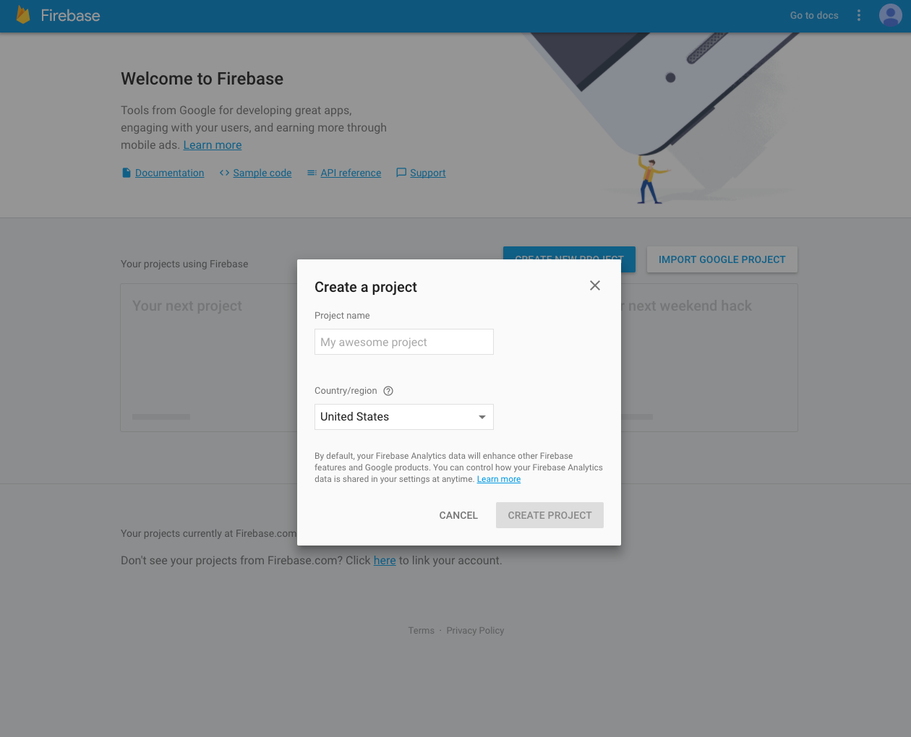
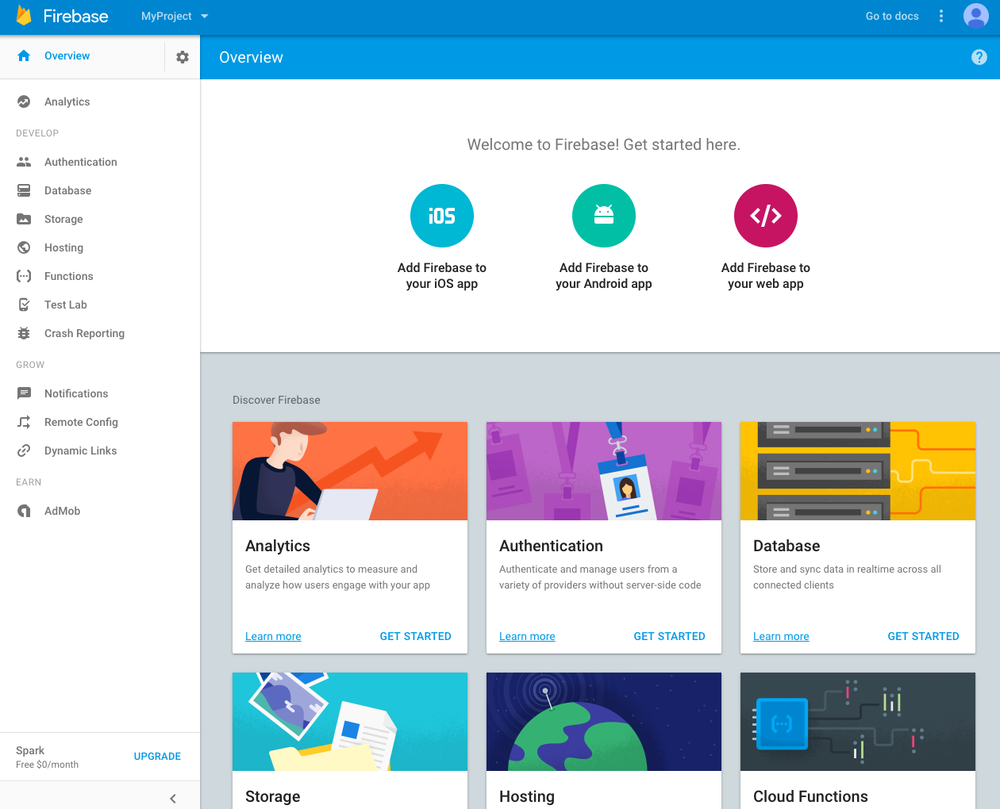
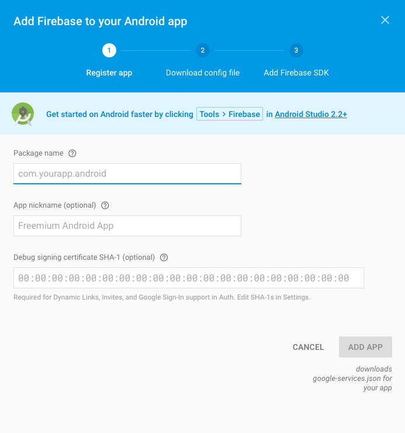
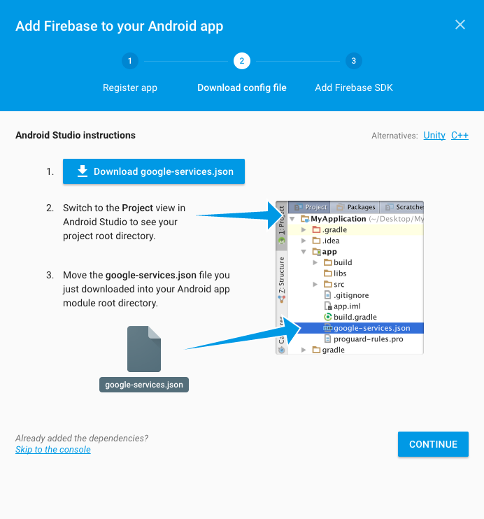
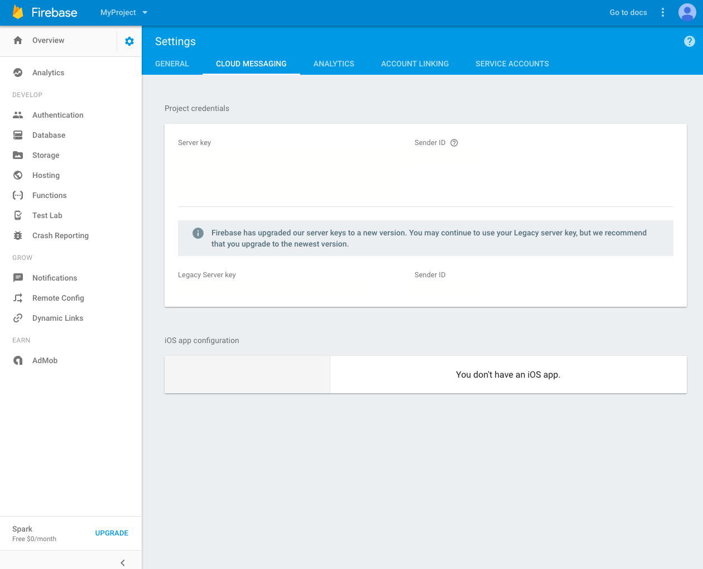

# Channel plugin FCM for Android
이 문서는 채널 플러그인의 FCM 기능을 사용하기 위한 가이드 문서 입니다.

아래 순서대로 진행하면 채널 플러그인 적용 후 푸시메시지를 받을 수 있습니다.

## Step 1. Firebase 프로젝트 생성
만약 진행 중인 Firebase 프로젝트가 있다면 이 단계를 건너 뛰고 Step 2로 이동 합니다.

먼저 Firebase 콘솔로 이동합니다.

그리고 아래 화면에서 새 프로젝트 만들기를 클릭하고 프로젝트 이름과 국가/지역을 선택하고 프로젝트 만들기를 클릭합니다.



프로젝트가 생성되면 아래 화면에서 Android 앱에 Firebase 추가를 클릭합니다.



그리고 아래 화면에서 채널 플러그인을 사용할 앱의 패키지 이름, 앱 닉네임, 디버그 서명 인증서를 각각 입력하고 앱 추가 버튼을 클릭 합니다.



google-services.json 파일을 다운로드 하고 아래 화면에서 안내하고 있는 위치에 파일을 넣습니다. 마지막으로 계속 버튼을 클릭하고 bundle.gradle을 수정하여 gradle 세팅을 합니다.




## Step 2. 채널 플러그인 안드로이드 설정에 서버키 등록
아래 화면에서 좌측 상단의 설정 버튼(톱니바퀴 모양)을 누르고 프로젝트 설정으로 이동합니다.


클라우드 메시징 탭을 선택하고 서버키를 복사합니다.



채널 데스크의 `채널 설정`에서 `모바일 앱 푸시 연동`으로 이동합니다


Android 연동 버튼을 클릭하여 `API Key`란에 `복사한 서버키`를 넣고 추가 버튼을 누릅니다.


## Step 3. 푸시 알림 타이틀 설정
Notification의 타이틀로 사용할 텍스트를 `string resource`로 설정합니다.
```xml
<resources>
  ...
  <string name="notification_title">Your notification title</string>
  ...
</resources>
```


## Step 4. FCM 커스텀 아이콘과 타이틀 등록
만약 Notification의 아이콘을 수정하고 싶다면 아래의 파일 경로에 동일한 파일 이름을 가진 이미지를 추가하면 됩니다.

`Notification small icon`
- /res/drawable/ch_push_icon.png

`Notification large icon`
- /res/drawable-xxxhdpi/ch_push_large_icon.png
- /res/drawable-xxhdpi/ch_push_large_icon.png
- /res/drawable-xhdpi/ch_push_large_icon.png
- /res/drawable-hdpi/ch_push_large_icon.png
- /res/drawable-mdpi/ch_push_large_icon.png


## Step 5. 채팅방으로 이동
푸시 메시지에는 메시지에 대한 값이 저장되어 있기 때문에 원하는 채팅방으로 이동할 수 있습니다.

푸시 메시지를 처리하려면 앱을 실행하였을 때 첫 화면이 되는 `Activity`의 `onCreate()` 함수 마지막 줄에  아래 코드를 추가해주세요.
```java
public class MyActivity extends AppCompatActivity {

  @Override
  public void onCreate() {
    super.onCreate();
    
    // TODO : Your code
    // ...
    // ...
    ChannelPushClient.handlePushMessage(this);
  }
}
```


## Step 6. 다른 FCM 기능과 채널 플러그인의 FCM 기능을 함께 사용 하는 방법 (Optional)
이 단계에서는 현재 FCM을 사용 중인 프로젝트에 채널 플러그인의 FCM 기능을 함께 사용 하는 방법에 대해서 설명하고 있습니다.

기존 프로젝트에 이미 FCM 기능을 사용 중이라면 `FirebaseInstanceIdService`를 상속하는 클래스와와 `FirebaseMessagingService`를 상속하는 클래스를 수정 해야 합니다.

`FirebaseInstanceIdServic`e의 경우
```java
public class MyFirebaseInstanceIDService extends FirebaseInstanceIdService {

  @Override
  public void onTokenRefresh() {
    String token = FirebaseInstanceId.getInstance().getToken();
    
    if (!TextUtils.isEmpty(token)) {
      PrefSupervisor.setDeviceToken(this, token);
    }
  }
}
```
`onTokenRefresh()` 메서드가 호출되었을 때 token 값을 채널 플러그인 서버로 전달해야 합니다.

`FirebaseMessagingService`의 경우
```java
public class MyFirebaseMessagingService extends FirebaseMessagingService {

  @Override
  public void onMessageReceived(RemoteMessage remoteMessage) {
    Map<String, String> messages = remoteMessage.getData();
    
    if (ChannelPushManager.isChannelPluginMessage(messages)) {
      ChannelPushManager.handlePush(this, messages);
    } else {
      // TODO : Enter your code
    }
  }
}
```
`onMessageReceived()` 메서드가 호출될 때, 채널 플러그인에서 보낸 메시지인지 확인하는 부분을 추가하고 아니라면 클라이언트의 작업을 수행하면 됩니다.
